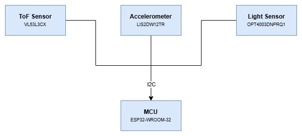
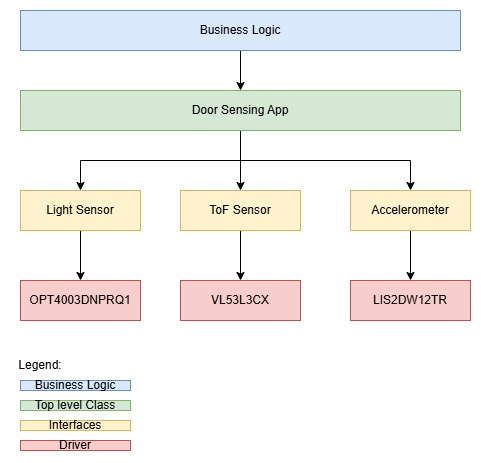
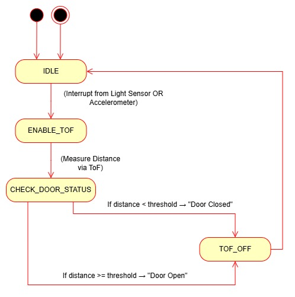

# _ESP32 DOOR SENSING_

## Hardware Design



[OPT4003DNPRQ1] https://www.ti.com/lit/gpn/OPT4003-Q1
[LIS2DW12] https://www.st.com/resource/en/datasheet/lis2dw12.pdf

## Firmware Architecture



## Firmware Design

```C++

// Light Sensor
bool init();
bool lightTriggered(const float tressHold);

// ToF Sensor
void powerOn();
void powerOff();
bool init();
int getDistance();

// Accelerometer
void init();
bool motionDetected();

```

## Program State Chart


